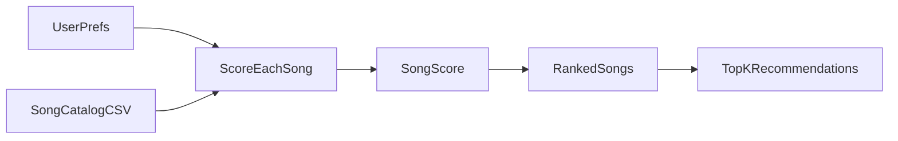

# 🎵 Music Recommender Simulation

## Project Summary

In this project you will build and explain a small music recommender system.

Your goal is to:

- Represent songs and a user "taste profile" as data
- Design a scoring rule that turns that data into recommendations
- Evaluate what your system gets right and wrong
- Reflect on how this mirrors real world AI recommenders

This repository implements a small **content-based** music recommender: songs and user taste are represented as structured data, a scoring rule ranks tracks against an explicit profile, and the top matches are returned for exploration and testing.

---

## How The System Works

Real recommendation systems combine content, collaborative behavior, and context. This project intentionally prioritizes a transparent **content-based** design, so each recommendation can be traced back to song attributes and a user taste profile.

### Step 1: Define your data

I expanded `data/songs.csv` from 10 songs to 18 songs, preserving the existing headers:
`id`, `title`, `artist`, `genre`, `mood`, `energy`, `tempo_bpm`, `valence`, `danceability`, `acousticness`.

The added rows include genres and moods not in the starter file, including classical/serene, hip hop/confident, metal/aggressive, reggae/uplifted, country/nostalgic, edm/euphoric, blues/somber, and latin/festive. This gives the recommender a wider range of vibe targets.

Suggested Copilot prompt for dataset expansion:

> With `#file:songs.csv` as context, generate 5-10 additional songs in valid CSV format using the exact existing headers. Add diverse genres and moods not yet present in the file, and keep numeric features realistic (`energy`, `valence`, `danceability`, `acousticness` in 0.0-1.0 range and `tempo_bpm` in plausible BPM ranges).

### Step 2: Create a user profile

I use this concrete taste profile dictionary for comparisons:

```python
user_profile = {
    "favorite_genre": "lofi",
    "favorite_mood": "chill",
    "target_energy": 0.40,
    "likes_acoustic": True,
}
```

This profile should clearly separate tracks like intense rock/metal (high energy, low acousticness, different mood) from chill lofi tracks (lower energy, chill mood, often higher acousticness).

Suggested Inline Chat critique prompt:

> Critique this profile for recommendation quality: `{'favorite_genre':'lofi','favorite_mood':'chill','target_energy':0.40,'likes_acoustic':True}`. Will these preferences reliably distinguish intense rock from chill lofi, or is the profile too narrow? Suggest one improvement if needed.

### Step 3: Sketch recommendation logic

Algorithm recipe:

- `+2.0` points if `song.genre` matches `favorite_genre`.
- `+1.0` point if `song.mood` matches `favorite_mood`.
- Add energy similarity points using closeness to target:  
  `energy_score = 1 - abs(song.energy - target_energy)`.
- Add acoustic alignment points based on `likes_acoustic`:  
  if true, reward higher `acousticness`; if false, reward lower `acousticness`.
- Final song score is a weighted sum of these components.
- Ranking rule: score every song, sort descending by score, return top `k`.

Suggested "Scoring Logic Design" prompt:

> Using `#file:songs.csv`, propose a point-weighting strategy that balances genre and mood matches with numeric similarity (especially energy). Compare at least two options and explain when mood should count less or more than genre.

Why both scoring and ranking are needed: scoring evaluates one song against the user, while ranking converts all scores into an ordered recommendation list.

### Step 4: Visualize the design



### Step 5: Bias and limitations note

This system may over-prioritize exact genre matches and miss songs that match the user’s mood or energy but use different genre labels. Because it uses a small hand-curated catalog and no collaborative/context signals, it can reflect dataset bias and produce narrow recommendations.

---

## Getting Started

### Setup

1. Create a virtual environment (optional but recommended):

   ```bash
   python -m venv .venv
   source .venv/bin/activate      # Mac or Linux
   .venv\Scripts\activate         # Windows

2. Install dependencies

```bash
pip install -r requirements.txt
```

3. Run the app:

```bash
python -m src.main
```

### Running Tests

Run the starter tests with:

```bash
pytest
```

You can add more tests in `tests/test_recommender.py`.

---

## Experiments You Tried

Use this section to document the experiments you ran. For example:

- What happened when you changed the weight on genre from 2.0 to 0.5
- What happened when you added tempo or valence to the score
- How did your system behave for different types of users

---

## Limitations and Risks

Summarize some limitations of your recommender.

Examples:

- It only works on a tiny catalog
- It does not understand lyrics or language
- It might over favor one genre or mood

You will go deeper on this in your model card.

---

## Reflection

Read and complete `model_card.md`:

[**Model Card**](model_card.md)

Write 1 to 2 paragraphs here about what you learned:

- about how recommenders turn data into predictions
- about where bias or unfairness could show up in systems like this


---

## 7. `model_card_template.md`

Combines reflection and model card framing from the Module 3 guidance. :contentReference[oaicite:2]{index=2}  

```markdown
# 🎧 Model Card - Music Recommender Simulation

## 1. Model Name

Give your recommender a name, for example:

> VibeFinder 1.0

---

## 2. Intended Use

- What is this system trying to do
- Who is it for

Example:

> This model suggests 3 to 5 songs from a small catalog based on a user's preferred genre, mood, and energy level. It is for classroom exploration only, not for real users.

---

## 3. How It Works (Short Explanation)

Describe your scoring logic in plain language.

- What features of each song does it consider
- What information about the user does it use
- How does it turn those into a number

Try to avoid code in this section, treat it like an explanation to a non programmer.

---

## 4. Data

Describe your dataset.

- How many songs are in `data/songs.csv`
- Did you add or remove any songs
- What kinds of genres or moods are represented
- Whose taste does this data mostly reflect

---

## 5. Strengths

Where does your recommender work well

You can think about:
- Situations where the top results "felt right"
- Particular user profiles it served well
- Simplicity or transparency benefits

---

## 6. Limitations and Bias

Where does your recommender struggle

Some prompts:
- Does it ignore some genres or moods
- Does it treat all users as if they have the same taste shape
- Is it biased toward high energy or one genre by default
- How could this be unfair if used in a real product

---

## 7. Evaluation

How did you check your system

Examples:
- You tried multiple user profiles and wrote down whether the results matched your expectations
- You compared your simulation to what a real app like Spotify or YouTube tends to recommend
- You wrote tests for your scoring logic

You do not need a numeric metric, but if you used one, explain what it measures.

---

## 8. Future Work

If you had more time, how would you improve this recommender

Examples:

- Add support for multiple users and "group vibe" recommendations
- Balance diversity of songs instead of always picking the closest match
- Use more features, like tempo ranges or lyric themes

---

## 9. Personal Reflection

A few sentences about what you learned:

- What surprised you about how your system behaved
- How did building this change how you think about real music recommenders
- Where do you think human judgment still matters, even if the model seems "smart"

